#  <strong>实验室GPU服务器的LXD虚拟化 <strong>
实验室GPU服务器的LXD虚拟化
实验室GPU服务器的LXD虚拟化 实验室破天荒加了台GPU服务器，因为实验室人数比较多，如果用同一台，文件、环境、软件等错乱混杂，有强迫症。。。所以我们做了虚拟化。

> ## 第一步：宿主机的安装与配置
>> ### 服务器系统的安装  
>>> 建议安装server版，通过ssh远程 [ubuntu镜像](http://cdimage.ubuntu.com/releases/18.04/release/ubuntu-18.04.2-server-arm64.iso "image")  
>>> 服务器一般有一块SSD和多块机械做成的RAID的阵列，系统安装在SSD（比较小）还有一块RAID阵列的数据盘  
>>### 服务器显卡驱动的安装  
>>>(如不能访问，在pdf文件夹已经离线好)  
>>> [显卡驱动安装](https://medium.com/@cjanze/how-to-install-tensorflow-with-gpu-support-on-ubuntu-18-04-lts-with-cuda-10-nvidia-gpu-312a693744b5 "linux显卡驱动安装"), 
>>>安装NVIDIA显卡驱动、CUDA、cuDNN


> ## 第二步：lxd的安装与初始化
>>### 安装lxd 
>>> LXD 实现虚拟容器  
>>> ZFS 用于管理物理磁盘，支持LXD高级功能  
>>> bridge-utils 用于搭建网桥  
>>>#### 安装LXD、ZFS和bridge-utils  
>>>>`sudo apt-get install lxd zfsutils-linux bridge-utils`
>>### 配置网桥:
>>>因为学校信息中心网络问题，如果配置桥接网卡，会导致流量异常，直接断网，因此实现每人一个ip的方式失败，不得已我们采用端口转发的方式来实现各个容器的网络
>>### 配置ZFS
>>>首先，我们运行sudo fdisk -l列出服务器上的可用磁盘和分区，我们有两块硬盘，第一块为系统盘，第二块为数据盘，现在我们将数据盘（/dev/sdb）分出需要使用的空间，作为容器的存储卷。  
>>>### 查看分区
>>>>`sudo fdisk /dev/sdb`  
>>>
>>>  
>>>按照下图分出了80GB的分区作为容器的存储卷，分区为/dev/sdb1，剩下的空间同理可以分区，可以作为服务器另外的应用使用  
>>>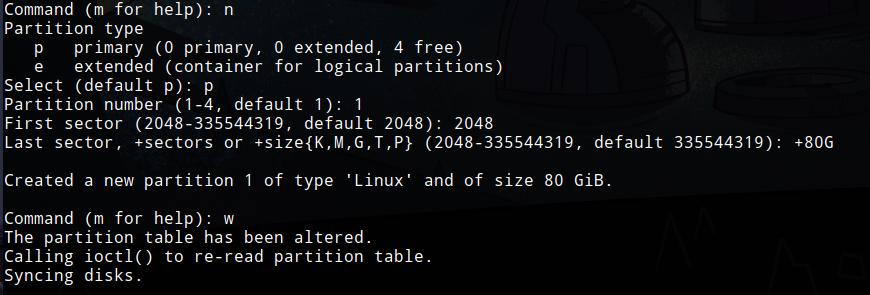  
>>### 创建块设备  
>>>#### 在块设备 /dev/sdb1 上创建一个ZFS存储池  
>>>>`sudo lxc storage create zfs-pool zfs source=/dev/sdb1`  
>>### LXD初始化  
>>>`sudo lxd init`   
>>>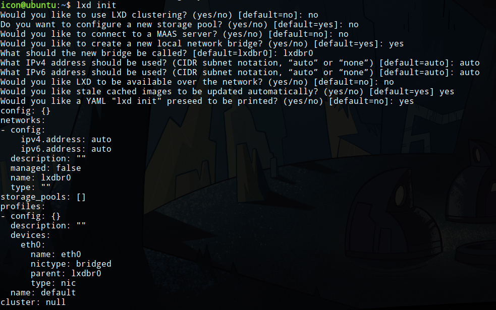  
>>>因为我们已经创建好了一个叫zfs-pool的存储池，所以在lxd初始化时不需要创建新的储存池，之后在进行配置即可  
>>>### 再次配置
>>>>`sudo lxc profile edit default`  
>>>### 修改磁盘大小
>>>在配置时还将每个容器的硬盘大小限制为固定大小  
>>>（如果没有设置，容器里面的磁盘大小为整个储存池的大小）  
>>>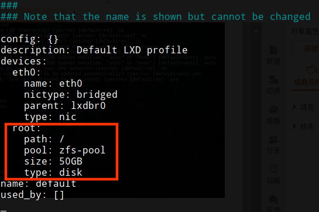  

># 第三步：容器的创建  
>>## 加速源  
>>>### 使用清华的镜像源（加速创建）  
>>>>`sudo lxc remote add tuna-images https://mirrors.tuna.tsinghua.edu.cn/lxc-images/ --protocol=simplestreams --public`  
>>>### 列出可用的镜像  
>>>>`sudo lxc image list tuna-images: ` 
>>## 创建ubuntu容器  
>>>### 使用清华源中的ubuntu镜像创建一个叫test的容器  
>>>>`sudo lxc launch tuna-images:ubuntu/18.04 test`  
>>## 进入容器  
>>>`sudo lxc exec test bash`  
>>>
>>>我们登录的是root用户，在这个容器中已经存在了一个叫ubuntu的用户  
>>## 修改密码  
>>>`passwd root`  
>>>`passwd ubuntu`   
>>>
>>>容器里的ubuntu是一个很精简的系统，需要安装各种软件  
>>## 安装ssh  
>>>`apt install ssh`  
>>## 通过ssh连接容器 
>>>### 查看容器与宿主机的ip  
>>>>因为我们没有设置桥接网卡，不能从外部电脑访问容器（不能ping通容器的ip），因此我们采用端口转发的方式来访问我们的容器，所以
>>>>#### 退出容器  
>>>>>`exit`  
>>>>#### 在宿主机查看容器  
>>>>>`sudo lxc list`  
>>>>#### 图中可知容器的ip地址为10.152.210.183  
>>>>  
>>>>#### 查看宿主机ip地址
>>>>>`ip addr`  
>>>>#### 可知宿主机ip为172.22.24.126  
>>>## 端口转发  
>>>>`sudo iptables -t nat -A PREROUTING -d 172.22.24.126 -p tcp --dport 60601 -j DNAT --to-destination 10.152.210.183:22`  
>>>
>>>>60610是我们定的端口号，通过宿主机的60601端口号映射到容器中22端口号（SSH默认端口号）
 
># 第四步：容器的配置  
>>## ssh连接容器并配置  
>>>`ssh ubuntu@172.22.24.126 -p 60601`
>>## 1. 更换源  
>>>### 备份原来的源  
>>>>`sudo mv /etc/apt/sources.list  /etc/apt/sources.list.bak`  
>>>### 编辑写入网易源  
>>>### （注意系统版本 ubuntu 18.04）  
>>>>`sudo vim /etc/apt/sources.list`  
>>>```
>>>deb http://mirrors.163.com/ubuntu/ bionic main restricted universe multiverse
>>>deb-src http://mirrors.163.com/ubuntu/ bionic main restricted universe multiverse
>>>deb http://mirrors.163.com/ubuntu/ bionic-security main restricted universe multiverse
>>>deb-src http://mirrors.163.com/ubuntu/ bionic-security main restricted universe multiverse
>>>deb http://mirrors.163.com/ubuntu/ bionic-updates main restricted universe multiverse
>>>deb-src http://mirrors.163.com/ubuntu/ bionic-updates main restricted universe multiverse
>>>deb http://mirrors.163.com/ubuntu/ bionic-proposed main restricted universe multiverse
>>>deb-src http://mirrors.163.com/ubuntu/ bionic-proposed main restricted universe multiverse
>>>deb http://mirrors.163.com/ubuntu/ bionic-backports main restricted universe multiverse
>>>deb-src http://mirrors.163.com/ubuntu/ bionic-backports main restricted universe multiverse
>>>```  
>>## 2. 安装图形化界面  
>>>### 刷新源
>>>>`sudo apt update`  
>>>### 最小化安装gnome桌面
>>>>`sudo apt install gnome-shell gnome-session gnome-panel gnome-terminal -y`  
>>## 3.安装远程连接  
>>>### 使用安装脚本（安装git后下载我们之后需要用的东西）  [安装脚本地址](http://c-nergy.be/blog/?p=13432 "安装脚本")  
>>>>`sudo apt install git`  
>>>>`git clone https://github.com/shenuiuin/LXD_GPU_SERVER`  
>>>### 打开文件夹  
>>>>`cd LXD_GPU_SERVER/`  
>>>### 赋予脚本可执行权限  
>>>>`sudo chmod a+x install-xrdp-2.3.sh`  
>>>### 脚本会下载一些文件，需要有Downloads文件夹  
>>>>`mkdir -p ~/Downloads`  
>>>###  安装脚本
>>>>`./install-xrdp-2.3.sh -s yes -g yes`  
>>>### 安装完成  
>>>  
>>## 4. 远程连接测试  
>>>### 端口转发   
>>>在安装好XRDP后，与之前一样，因为我们ping不通容器，所以我们需要将xrdp的端口转发到宿主机上  
>>>>`sudo iptables -t nat -A PREROUTING -d 172.22.24.126 -p tcp --dport 60611 -j DNAT --to-destination 10.152.210.183:3389` 
>>>### 远程连接  
>>>>60611是我们定的端口号，通过宿主机的60611端口号映射到容器中3389端口号（XRDP默认端口号）  
>>>可以通过windows的远程连接来使用容器(windows运行mstsc)  
>>>>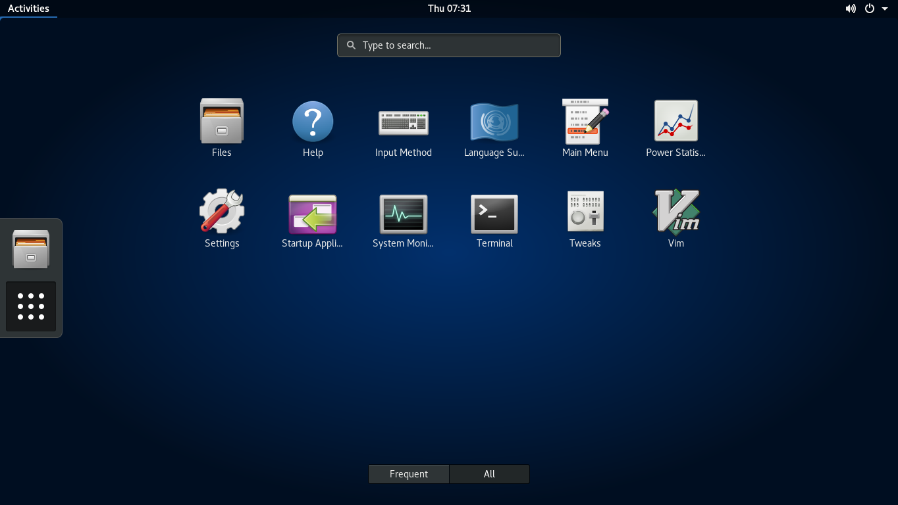  
>>>>接下来就是当普通的ubuntu来使用，比如可以找一些教程：安装完ubuntu必做的事等等  
>>## 5. 为容器添加显卡与安装驱动
>>>我们回到宿主机  
>>>### 为容器添加所有GPU:  
>>>>`lxc config device add yourContainerName gpu gpu`  
>>>### 添加指定GPU：  
>>>>`lxc config device add yourContainerName gpu0 gpu id=0`  
>>>## 为容器安装驱动 
>>>添加好显卡后，就相当于我们给容器安装了显卡，我们回到容器，然后安装显卡驱动    
>>>与宿主机的显卡版本必须一致，安装方法参考第一步NVIDIA显卡驱动、CUDN、cuDNN的安装  
>>>需要注意的是容器里面安装显卡驱动时需要加上后面的参数，安装时不需要安装到内核  
>>>>`sudo sh ./NVIDIA-Linux-X86_64-[YOURVERSION].run --no-kernel-module`  
># 第五步：ubuntu的美化等配置  
>>## icon图标主题  
>>>`sudo apt update`  
>>>`sudo apt install papirus-icon-theme`  
>>## GTK主题  
>>>`git clone https://github.com/vinceliuice/vimix-gtk-themes`  
>>>`cd vimix-gtk-themes`  
>>>`sudo ./vimix-installer`  
>>## 应用主题  
>>>主题安装好后用使用gnome-tweak-toos来应用主题  
>>>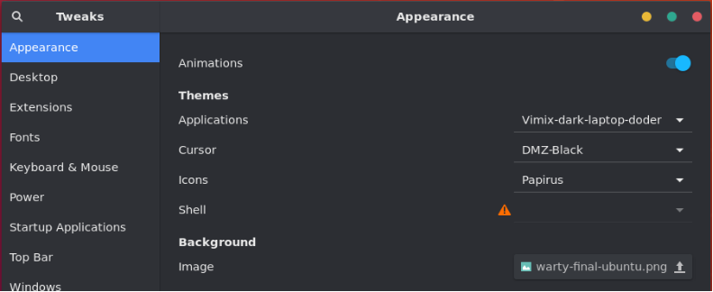   
>>>还可以个性化你的ubuntu，比如加上最大化最小化按钮  
>>>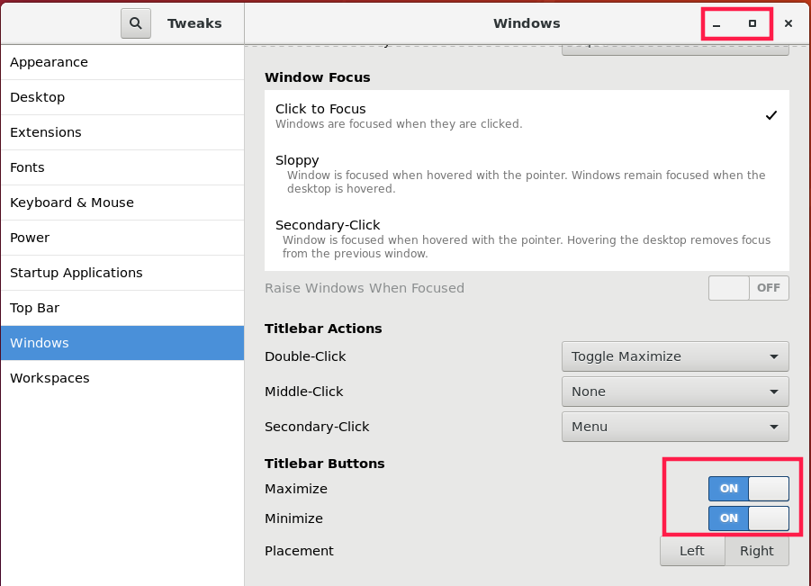  
>>## gnome扩展  
>>>直接在ubuntu的应用商店安装，推荐的这些扩展   
>>>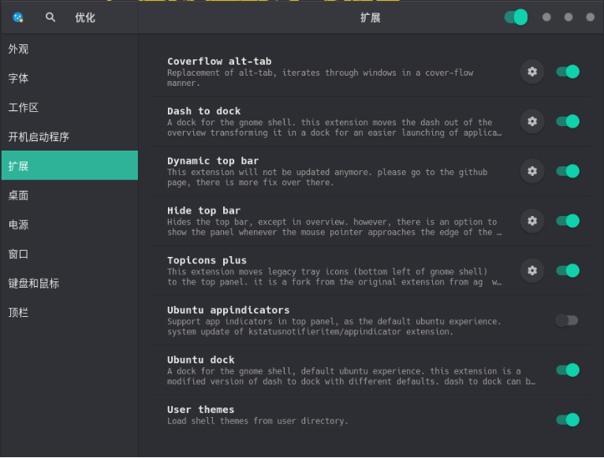   
>>## 切换中文  
>>>系统的中文在Language Support。然后添加简体中文的语言将中文拖到第一项，然后应用到整个系统  
>>>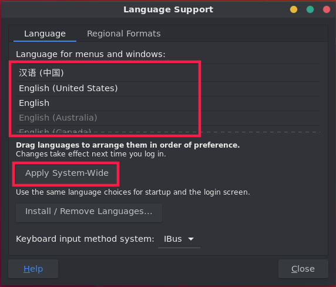  
>>## 保留旧的名称
>>>重启之后会有提示将文件夹的名字改成中文（最好还是用旧的名称，英文路径）  
>>>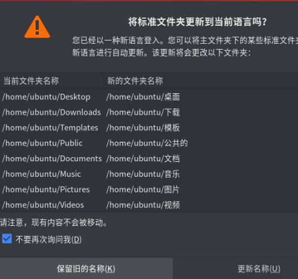  
>>## 安装需要的软件  
>>>### 搜狗输入法、谷歌浏览器等等  
>>>### 显示Linux系统信息  
>>>>`sudo apt install neofetch`  
>>>>`neofetch`
>>>### 查看CPU运行以及内存占用情况   
>>>>`sudo apt install htop`  
>>>>`htop` 
>>>### 查看显卡运行情况  
>>>>`nvidia-smi`  
>>>### 实时查看显卡运行情况(按照0.1s的频率实时刷新)  
>>>>`watch -n0.1 nvidia-smi`  

># 第六步：容器管理  
>>## 端口转发表管理  
>>>由于我们用端口转发的方式来连接容器，不过宿主机重启时会丢失路由表规则  
>>>### 列出端口规则  
>>>>`sudo iptables -t nat -L PREROUTING --line-number`  
>>>### 删除第一行的规则  
>>>>`sudo iptables -t nat -D PREROUTING 1`  
>>>### 保存规则（防止重启后转发表丢失）
>>>>`sudo netfilter-persistent save`  
>>>### 恢复保存的转发规则  
>>>>`sudo netfilter-persistent reload`  
>>## lxdui-更简单的方式管理容器  
>>>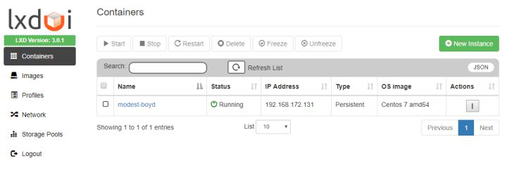   
>>>### 下载运行
>>>地址：[lxdui](https://github.com/AdaptiveScale/lxdui "lxdui")  
>>>安装lxdui之前需要安装python3-dev，不然会出错  
>>>>`sudo apt install python3-dev`  
>>>### 登录lxdui
>>>安装好后网页登录管理工具  
>>>http:(宿主机ip):15151  
>>## 为容器修改硬件配置
>>>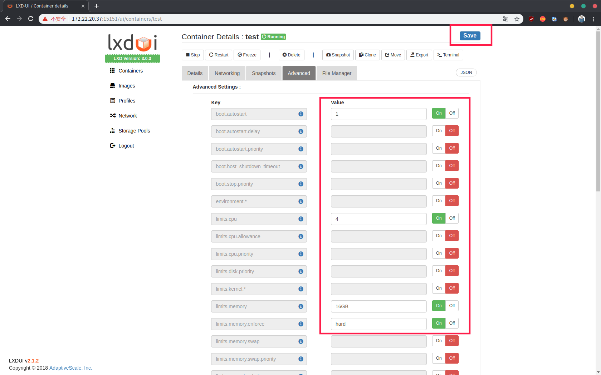 
>>>在这个工具里面可以配置容器的各个参数，我们实验室的宿主机为256G内存，cpu48个核，容器主要用的是显卡，其他的参数按照人数平均分配一下，够用就可以  
>>## 管理员须知  
>>>管理员应在桌面上新建使用说明read.txt，写下系统的版本等信息、安装了什么软件、各种注意事项等等  

># 第七步：容器模板
>>我们把这个配置好的容器当成模板，保存为镜像。
>>>## 停止容器  
>>>>`sudo lxc stop test`  
>>>## 将test容器保存为ubuntudemo镜像  
>>>>`sudo lxc publish test --alias ubuntudemo --public`  
>>## 从模板镜像中新建容器
>>以后直接用模板镜像来创建容器，容器创建好后还要为它添加显卡（驱动已经有了），还有用lxdui配置它的参数，最后为它添加端口映射
>> 

 
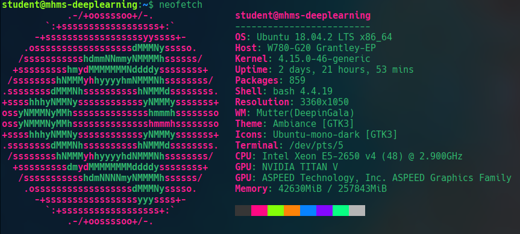 
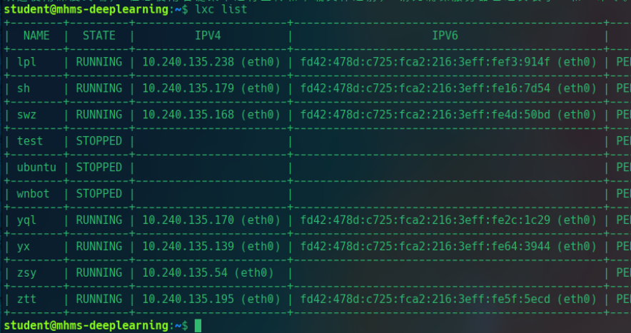 
